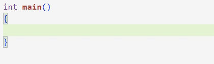
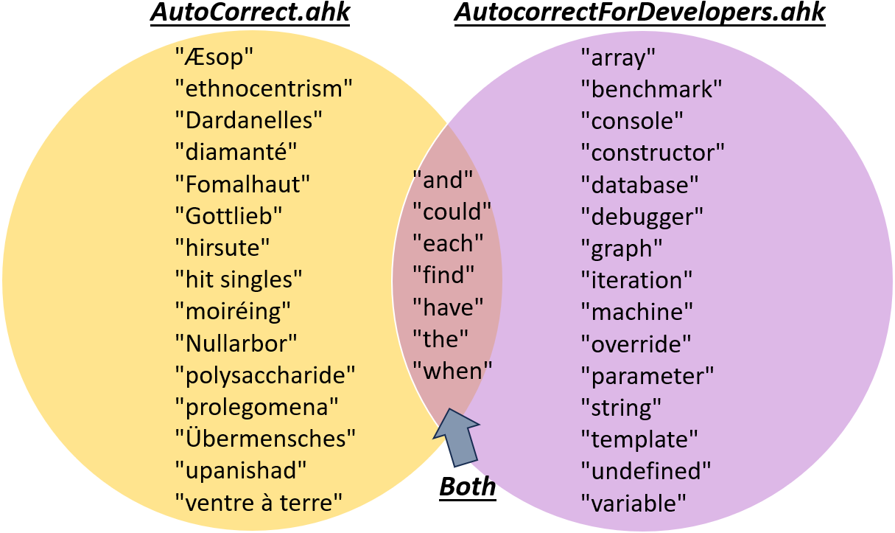

# AutocorrectForDevelopers
**_AutocorrectForDevelopers_** is a multi-platform script which automatically fixes typos using rules tailored for software developers. *AutocorrectForDevelopers* can be run through [AutoHotkey](https://www.autohotkey.com/) (AHK) or [Espanso](https://github.com/espanso/espanso). The script's rules contain many corrections for common developer words involving keywords, classes, methods, programming languages, and software engineering concepts. This script reduces runtime errors and boosts developer productivity.

## How does it work?
Corrections happen automatically as you type:

By default, *AutocorrectForDevelopers.ahk* runs against all applications (except Microsoft Word), although the script can be customized to enable or disable any application (see the `#HotIf/#If` statement early in the script).

## Installation
### AutoHotkey users
Install [AutoHotkey](https://www.autohotkey.com/) v2, then run [*AutocorrectForDevelopers.ahk*](AutocorrectForDevelopers.ahk).

### Espanso users
Install [Espanso](https://espanso.org/) for your platform, then [load](https://espanso.org/docs/get-started/) the config file [*AutocorrectForDevelopers.yaml*](AutocorrectForDevelopers.yaml).

To match the behavior of the AutoHotkey script, update your Espanso [settings](https://espanso.org/docs/configuration/options/) to set `undo_backspace` to `false`, and append these `word_separators` to the default list: ``"-", "`", "&", "|", "_"``.

## Testing
All [tests](https://github.com/tnear/AutocorrectForDevelopers/tree/main/test) are run before pushing to GitHub, ensuring that new rules do not interfere with any existing rules.

## FAQ
### Does this script support AutoHotkey v1?
Absolutely! (although v2 is preferred). AHK v1 is deprecated by the AHK development team. There is a legacy v1 version of the *AutocorrectForDevelopers* script [here](assets/AutocorrectForDevelopersV1Legacy.ahk) which supports AHK v1. A friendly word of caution: the v1 script is not exhaustively tested like the v2 script nor is it guaranteed to contain the latest rules.

### How does *AutocorrectForDevelopers.ahk* compare to AutoHotkey's official *AutoCorrect.ahk* script?
[Here](https://www.autohotkey.com/download/AutoCorrect.ahk) is AutoHotkey's official autocomplete script. It is based in Wikipedia's [common misspellings](https://en.wikipedia.org/wiki/Wikipedia:Lists_of_common_misspellings/For_machines) list which dates back to [2005](https://en.wikipedia.org/w/index.php?title=Wikipedia:Lists_of_common_misspellings/For_machines&oldid=11834258). Jim Biancolo [ported](https://www.biancolo.com/blog/autocorrect/) Wikipedia's list to an AutoHotkey script in 2006 and it has been officially hosted by AutoHotkey.com since 2007. The original script is widely influential and has been used successfully by many people for years.

Shown below is a Venn diagram comparing excerpts from the official *AutoCorrect.ahk* with *AutocorrectForDevelopers.ahk*:

*AutoCorrect.ahk*, shown in yellow, contains many rules for rare words which software engineers are unlikely to need. It also introduces many accented characters which are correct but developer unfriendly. Lastly, the official script hasn't seen much active development in the last 15 years and therefore is missing new technology terminology.

*AutocorrectForDevelopers.ahk*, shown in purple, contains many common software engineering terms which are absent from *AutoCorrect.ahk*. Because *AutocorrectForDevelopers.ahk* is developer-centric, it will fix a higher percentage of your typos.

## Common developer typos added for...
- Languages: AutoHotkey, C, C++, C#, COBOL, CSS, FORTRAN, Go, Java, JavaScript, Julia, Kotlin, MATLAB, Perl, PHP, Python, R, Ruby, Rust, Scala, SQL, Swift, Visual Basic
- Programs: GDB, Git, PowerShell, UNIX CLI
- Subjects: algorithms, artificial intelligence, cloud computing, compilers, concurrency, cryptography, databases, distributed systems, linear algebra, machine learning, networking, operating systems, security, statistics, system design
- (more to come!)

## Does this support [Espanso](https://github.com/espanso/espanso)?
Yes! Espanso is a cross-platform (Windows, macOS, Linux) text expander while AutoHotkey is scoped to Microsoft Windows. Load the generated file [*AutocorrectForDevelopers.yaml*](AutocorrectForDevelopers.yaml) in Espanso if you need non-Windows support.

The test point *test_writeToEspansoYamlFile* translates AutocorrectForDevelopers.ahk into YAML which can be consumed by Espanso.
