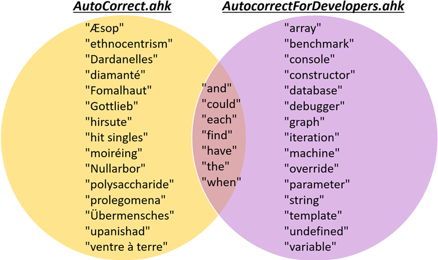

# AutocorrectForDevelopers
**_AutocorrectForDevelopers_** is an [AutoHotkey](https://www.autohotkey.com/) (AHK) script which automatically fixes typos using rules tailored for software developer environments. The rules in this script contain many corrections for common developer words involving keywords, classes, methods, programming languages, and programming disciplines. Using this script will reduce runtime errors, decrease compilation times, and boost development productivity.

## How does it work?
Corrections happen automatically as you type:

The default behavior for *AutocorrectForDevelopers.ahk* is to run on all applications (except Microsoft Word), although the script can be customized to enable or disable any application of your choice (see the `#HotIf/#If` statement in the script).

## Installation
Download & install [AutoHotkey](https://www.autohotkey.com/) v2, then download & run [*AutocorrectForDevelopers.ahk*](AutocorrectForDevelopers.ahk).

## Testing
All rules are continuously regression tested (see tests [here](https://github.com/tnear/AutocorrectForDevelopers/tree/main/test)). All tests are run before pushing to GitHub, hopefully ensuring that new rules do not interfere with any older rules.

## FAQ
### Does this script support AutoHotkey v1?
Absolutely! (although v2 is preferred). AHK v1 is in the process of being deprecated by the AHK development team. There is a legacy v1 version of the *AutocorrectForDevelopers* script [here](assets/AutocorrectForDevelopersV1Legacy.ahk) which supports AHK v1. A word of caution: this legacy script is not exhaustively tested like the main script nor is it guaranteed to contain the latest rules.

### How does *AutocorrectForDevelopers.ahk* compare to AutoHotkey's official *AutoCorrect.ahk* script?
[Here](https://www.autohotkey.com/download/AutoCorrect.ahk) is AutoHotkey's official autocomplete script. It is based in Wikipedia's [common misspellings](https://en.wikipedia.org/wiki/Wikipedia:Lists_of_common_misspellings/For_machines) list which dates back to [2005](https://en.wikipedia.org/w/index.php?title=Wikipedia:Lists_of_common_misspellings/For_machines&oldid=11834258). Jim Biancolo [ported](https://www.biancolo.com/blog/autocorrect/) Wikipedia's list to an AutoHotkey script in 2006 and it has been officially hosted by AutoHotkey.com since 2007. The original script is widely influential and has been used successfully by many people for years.

The official *AutoCorrect.ahk* contains heaps of rules which are either uncommon in developer workflows or introduce accented characters which are correct but developer unfriendly. The official script also hasn't seen much active development in the last 15 years and therefore supports AHK v1-only.

*AutocorrectForDevelopers.ahk*, however, focuses heavily on software engineering terminology and programming languages. The result is that this script will automatically fix a higher percentage of your typos if you are a software developer. The Venn diagram below shows example strings that each script autocorrects:

*AutocorrectForDevelopers.ahk* is shown in purple on the right. It contains many common software engineering terms and concepts which are absent from *AutoCorrect.ahk*. Also, it is a smaller circle because it contains thousands fewer rules than *AutoCorrect.ahk*.

*AutoCorrect.ahk* is shown on the left in yellow. It contains more rules overall, but many of those rules are for rare words which software developers are unlikely ever to need.

*AutocorrectForDevelopers.ahk* tries to fill the autocorrect gap for developers by including many software development typos which the esteemed *AutoCorrect.ahk* is missing.

## Common developer typos added for...
- Languages: C, C++, C#, CSS, Go, Java, JavaScript, Julia, MATLAB, PHP, Python, R, Ruby, Rust, SQL, Swift
- Programs: GDB, Git, PowerShell, UNIX CLI
- Topics: algorithms, artificial intelligence, cryptography, databases, machine learning, networking, operating systems
- (more to come!)
